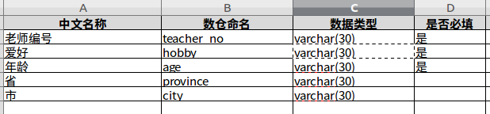

# extraction2structure
## 我的环境
```java
// 操作系统
Ubuntu16.04
//语言环境 
go1.9.2
//ide
vscode
```
## 目的
两个部门定义接口，结构体定义在了excle表格中了。如果数据少的话可以复制粘贴，但是很不幸，接口中设计的结构体非常多。本文的目的就是根据xlsx格式的文件，来抽取字段组装成go语言的结构体。


比如下面的结构体：



 
 ## 涉及的功能
```js
//具体会涉及以下方面的知识:
 1 读取excl框架的选取
 2 字段驼峰命名    首字母大写
 3 字段 添加  json tag
 4 结构体添加注释（每个字段的含义）
 5 注释以及字段 实现左对齐
```

## 思路
### 1、本文使用xlsx来读取excl文件
```
go get github.com/tealeg/xlsx
```

### 2、字段驼峰命名 首字母大写
读取字段那一列，根据"-"分割字符，把首字母大写封装后返回。例如`student_no`-->`StudentNo`

### 3、给字段添加json tag 以及 结构体添加注释
  这两方面都要实现左对齐，思路就是提前计算好每列中字符串的最大长度。在添加json tag时，如果字段的长度不够，就用空格来补。

## 执行结果
具体的实现都在`creatStruct.go`中，你可以根据自己的需求自定义。

执行`go run creatStruct.go`后，效果如下：
```go
//-----------Student-----------
// 学生编号    student_no
// 姓名        name
// 年龄        age

type Student struct {
	StudentNo string `json:"student_no"`
	Name      string `json:"name"`
	Age       string `json:"age"`
}

//-----------Teacher-----------
// 老师编号    teacher_no
// 爱好        hobby
// 年龄        age
// 省          province
// 市          city

type Teacher struct {
	TeacherNo string `json:"teacher_no"`
	Hobby     string `json:"hobby"`
	Age       string `json:"age"`
	Province  string `json:"province"`
	City      string `json:"city"`
}

```